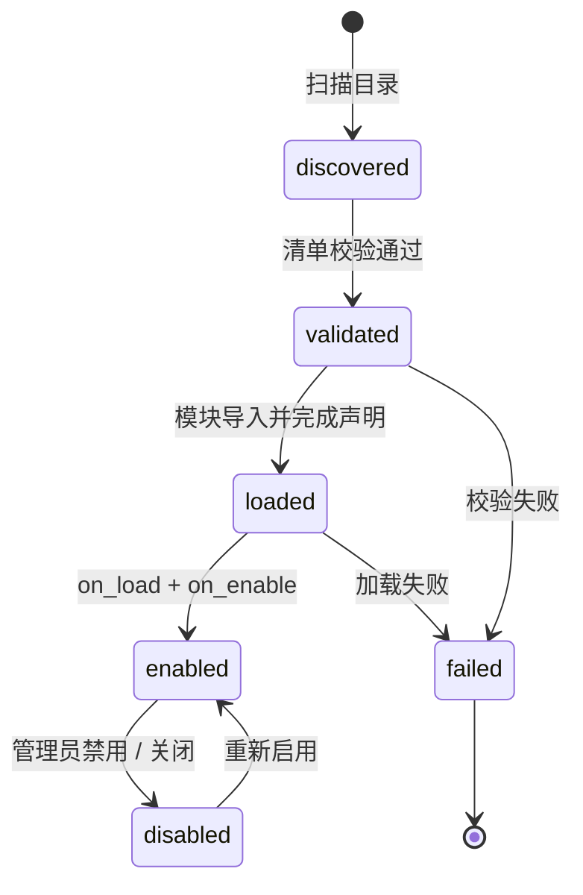

# 开发插件

UniBot 的扩展系统允许你通过少量代码为机器人增加指令、API 服务与渲染能力。本文档从零开始，带你编写、配置并分发一个自己的扩展。

## 扩展是什么

扩展（Extension）是 UniBot 的功能单元，存放在 `Extensions/` 目录下。一个扩展可以：

- **注册指令**（`command`）：为用户提供新的聊天指令。
- **提供 API 服务**（`api`）：暴露可被其它扩展或内置代码复用的服务能力。
- **提供渲染能力**（`render`）：为图片渲染提供新的引擎或主题。

同一个扩展可以同时声明多种类型，例如 `MyExt` 就同时是 `api` 与 `command` 类型。

扩展的生命周期由框架统一管理：



## 两种扩展形态

UniBot 支持两种组织代码的方式：

| 形态 | 适用场景 | 元数据来源 |
|------|---------|-----------|
| **单文件扩展** | 简单指令，一个 `.py` 文件即可 | 扩展实例/类的类属性 |
| **目录型扩展** | 多模块、含配置与依赖的完整扩展 | `Extension.toml` 清单 |

### 单文件扩展

把扩展写成一个位于 `Extensions/` 根目录的 Python 文件，通过构造参数或类属性声明元数据：

```python
# Extensions/Hello.py
from Scripts.Extensions import Command, Extension

# 创建唯一扩展实例：id 必须与文件名一致（Hello），放在开头
extension = Extension(id='Hello', name='你好', version='1.0.0', types=('command',))


@extension.register_command
class HelloCommand(Command):
    name = 'hello'
    description = '向你问好。'
    usage = '.hello'

    async def handler(self, session) -> str:
        return '你好，世界！'
```

**惯例：扩展在文件开头实例化唯一 `extension` 实例，后续所有能力类（指令 / 服务 / 渲染器）都用 `@extension.register_xxx` 装饰器登记。**

### 目录型扩展

当扩展需要多文件、业务配置或第三方依赖时，使用目录型扩展。目录结构如下：

```
Extensions/MyExt/
├── Extension.toml      # 清单（必填）
├── __init__.py         # 入口模块（必填，代码写在这里）
└── ...                 # 其它模块、资源
```

框架约定：

- 入口固定为包的 `__init__.py`，即 `importlib.import_module('Extensions/<id>')` 直接导入整个包；入口即 `__init__.py` 中的代码。
- 入口必须导出一个名为 `extension` 的 `Extension` 实例。
- 扩展目录缺少 `Extension.toml` 或 `__init__.py`，或 `id` 与目录名不一致，会被跳过。

## 编写 `Extension.toml` 清单

目录型扩展的元数据、兼容性与依赖都声明在清单中。清单由框架严格校验，未知字段或非法值会直接阻止加载。

```toml
[manifest]
schema_version = 1

[extension]
id = "MyExt"                    # 必填，PascalCase，与目录名一致
name = "示例扩展"                 # 必填
version = "1.0.0"               # 必填，语义化版本
author = "yourname"             # 可选
description = "扩展描述"          # 可选
types = ["api", "command"]      # api | command | render

[compatibility]
unibot = ">=0.0.5"              # 兼容的 UniBot 版本约束，'*' 表示任意

[dependencies]
extensions = ["OtherExt"]       # 依赖的其它扩展（id）
python = []                     # 需安装的第三方 Python 依赖

[render]                         # 仅渲染扩展需要
kind = ["engine"]                # engine | theme
theme_name = ""
```

### 各段说明

| 段 | 字段 | 说明 |
|----|------|------|
| `[manifest]` | `schema_version` | 清单格式版本，当前为 `1` |
| `[extension]` | `id` | 扩展唯一标识，仅允许字母、数字、下划线，且与目录名一致 |
| `[extension]` | `name` / `version` / `author` / `description` | 展示信息 |
| `[extension]` | `types` | 扩展类型列表，`api` / `command` / `render` |
| `[compatibility]` | `unibot` | 版本约束，格式遵循 [PEP 440](https://peps.python.org/pep-0440/)，如 `>=0.0.5` |
| `[dependencies]` | `extensions` | 依赖的其它扩展 id，用于拓扑排序与缺依赖检测 |
| `[dependencies]` | `python` | 需安装的第三方 Python 依赖 |
| `[render]` | `kind` / `theme_name` | 渲染扩展声明渲染引擎或主题 |

> 注意：`config_schema`（业务配置模型）**不写入** TOML，而是由扩展代码中的 `config_model` 定义，框架会自动从 Pydantic 模型生成 JSON Schema 供 WebUI 动态渲染表单。

### Python 依赖自动同步

扩展声明的 `[dependencies].python` 会在加载扩展时自动聚合去重，统一写入 `pyproject.toml` 的 `[project.optional-dependencies].extensions` 组。Watchdog 启动及检测到依赖变化时会执行 `uv sync --extra extensions` 自动安装，无需手动处理。卸载扩展后重新聚合，残留依赖会被移除。

> 注意：`extensions` 组由框架独占维护，请勿在 `pyproject.toml` 中手动编辑该组。

## 配置与数据目录

扩展拥有作用域受限的独立配置与数据目录，路径越界、访问其它扩展目录或覆盖框架保留文件都会被拒绝：

| 数据 | 目录/文件 | 写入者 | 内容 |
|------|-----------|--------|------|
| 扩展启停 | `Config/Extensions.toml` | 用户 / WebUI | 每个扩展的 `enabled` 标志 |
| 扩展配置 | `Config/Extensions/<id>.toml` | 用户 / WebUI | Pydantic 校验的业务配置 |
| 管理状态 | `Data/Extension/States.toml` | 框架 | 来源、版本、SHA-256、安装时间、依赖归属 |
| 业务数据 | `Data/Exs/<id>/` | 扩展数据工具 | 缓存、数据库、生成文件 |

扩展代码通过绑定后的 `extension.config` 与 `extension.data` 访问这些存储，无需关心路径细节。

## 开发指令扩展

指令扩展通过继承 `Command` 定义主命令，用实例装饰器 `@extension.register_command` 登记。子命令以嵌套 `SubCommand` 的形式声明。

下面是一个完整的目录型指令扩展示例：

### 1. 清单 `Extensions/Greet/Extension.toml`

```toml
[manifest]
schema_version = 1

[extension]
id = "Greet"
name = "问候扩展"
version = "1.0.0"
author = "yourname"
description = "一个问候指令示例。"
types = ["command"]

[compatibility]
unibot = ">=0.0.5"

[dependencies]
extensions = []
python = []
```

### 2. 入口 `Extensions/Greet/__init__.py`

```python
from Scripts.Extensions import Command, Extension, SubCommand
from nonebot_plugin_alconna import Match
from nonebot_plugin_uninfo import Uninfo


# 创建唯一扩展实例（放在开头）
extension = Extension(config_model=None)


@extension.register_command
class GreetCommand(Command):
    """问候主命令。"""

    name = 'greet'
    description = '向某人问好。'
    usage = '.greet [名字]'
    aliases = ('hi',)  # 可选别名

    def declare(self) -> None:
        """声明参数与子命令。"""
        self.register_option('name', str, default='朋友', description='要问候的名字')

    async def handler(self, session: Uninfo, name: Match[str]) -> str:
        """处理 greet 主命令。"""
        target = name.result if name.available else '朋友'
        return f'你好，{target}！'

    class Bye(SubCommand['GreetCommand']):
        """子命令：greet bye。"""

        name = 'bye'
        description = '道别'

        async def handler(self) -> str:
            return '再见！'


# 创建唯一扩展实例并登记命令
extension = Extension(config_model=None)
extension.register_command(GreetCommand)
```

### 3. 参数声明 API

在 `declare()` 中通过以下方法声明参数：

| 方法 | 说明 |
|------|------|
| `register_arg(name, type, ...)` | 注册必选参数 |
| `register_option(name, type, default=..., ...)` | 注册可选参数（带默认值） |
| `register_subcommand(sub)` | 显式注册子命令 |

常用参数选项：

- `required`：是否必填（可选参数必须带 `default`）。
- `default`：默认值。
- `description`：参数描述，用于生成帮助。
- `multi=True`：接受多个值（对应 Alconna `MultiVar`）。

### 4. 处理器返回值

处理器方法可以返回：

- **字符串**：直接作为消息发送。
- **图片字节**（配合 `image_handler`）：图片模式下发送 PNG。
- **列表**：多条消息片段，框架合并发送。
- **`None`**：不发送（处理器直接返回 `None`）。

```python
async def image_handler(self, session: Uninfo) -> bytes:
    """图片模式下渲染为 PNG 字节。"""
    return await render_template('Greet', (500, 0), **data)
```

## 开发 API 服务扩展

通过继承 `Service` 定义可复用的服务能力，用 `@extension.register_service` 登记。其它扩展或内置代码通过 `extension.api.get(ServiceType)` 获取，并得到对应服务的类型提示。

```python
from pydantic import BaseModel, Field
from Scripts.Extensions import Extension, Service


class GreetConfig(BaseModel):
    """业务配置，供 WebUI 表单与 Config.toml 使用。"""

    default_name: str = Field(default='朋友', description='默认问候名字')


# 创建唯一扩展实例（放在开头）
extension = Extension(config_model=GreetConfig)


@extension.register_service
class GreetService(Service):
    """问候服务。"""

    name = 'greet'

    def greet(self, name: str) -> str:
        default = extension.config.value.default_name
        return f'你好，{name or default}！'
```

### API 服务的使用

在任一已绑定的扩展中：

```python
service = extension.api.get(GreetService)
if service is not None:
    message = service.greet('张三')
```

## 扩展配置

声明 `config_model`（Pydantic 模型）后，框架会：

1. 为扩展创建 `Config/Extensions/<id>.toml`。
2. 用 `model_validate` 校验文件内容，非法内容会抛出 `StorageError` 且保留旧文件。
3. 通过 `get_config_schema()` 生成 JSON Schema，供 WebUI 动态渲染配置表单。

在代码中读取与更新配置：

```python
# 读取（已绑定后）
value = extension.config_value  # 当前配置模型
default_name = extension.config.value.default_name

# 更新（校验并原子持久化，失败不修改原配置）
extension.update_config({'default_name': '张三'})
```

## 生命周期钩子

扩展可以通过可选的协程方法参与生命周期管理：

| 方法 | 时机 | 用途 |
|------|------|------|
| `on_load()` | 模块导入、声明完成后 | 读取资源、初始化轻量状态 |
| `on_enable()` | 启动时 | 启动外部资源、连接服务 |
| `on_disable()` | 关闭时 | 释放外部资源、断开连接 |

```python
class MyExt:
    async def on_enable(self) -> None:
        # 启动外部服务
        await self.client.connect()

    async def on_disable(self) -> None:
        # 释放资源
        await self.client.close()
```

> 注意：`on_enable` 抛出的异常会被框架捕获，该扩展标记为 `failed`，并按逆拓扑顺序回滚其它已启用扩展，保证启动一致性。

## 开发渲染扩展

渲染扩展为图片渲染提供引擎或主题。

### 渲染引擎

继承 `BaseRenderer` 并实现 `setup` / `render` / `shutdown`：

```python
from Scripts.Extensions import BaseRenderer, Extension


# 创建唯一扩展实例（放在开头）
extension = Extension(config_model=None)


@extension.register_renderer
class MyRenderer(BaseRenderer):
    name = 'myengine'

    async def setup(self) -> None:
        # 初始化渲染资源
        pass

    async def render(self, html: str, css: str) -> bytes:
        # 返回 PNG 字节
        return png_bytes

    async def shutdown(self) -> None:
        pass
```

在清单中声明渲染类型：

```toml
[extension]
types = ["render"]

[render]
kind = ["engine"]
theme_name = ""
```

### 渲染主题

通过 `register_theme` 注册主题扩展的模板目录，声明 `kind = ["theme"]` 并提供 `theme_name`。

## 本地加载与市场分发

### 本地加载

将扩展文件或目录放入 `Extensions/` 后，在 `Config/Extensions.toml` 中确认或设置启停标志：

```toml
[MyExt]
enabled = true
```

未列出的扩展默认启用。修改启停配置后需重启生效。

### 市场分发

扩展通过 **GitHub Release** 以源码 zip 分发（不走 PyPI）：

1. 将扩展源码打包为 zip，确保根目录包含 `Extension.toml`。
2. 发布到 GitHub Release。
3. 在扩展注册表中登记条目：

```python
from Scripts.Extensions import MarketExtension, MarketRelease

market_entry = MarketExtension(
    id='Greet',
    name='问候扩展',
    repo='yourname/uni-exts',
    description='一个问候指令示例。',
    releases=[
        MarketRelease(
            version='1.0.0',
            asset_url='https://github.com/yourname/uni-exts/releases/download/v1.0.0/Greet.zip',
            sha256='...',
            unibot_version='*',
        ),
    ],
)
```

安装时框架会：

1. 从 Release 下载 zip。
2. 安全解压（拒绝路径穿越、符号链接、超限文件与 zip 炸弹）。
3. 校验清单与 `id`。
4. 记录来源、版本、SHA-256 与安装时间到 `Data/Extension/States.toml`。

## 内置扩展参考

`Extensions/` 目录下已内置 8 个单文件扩展（`About` / `Bound` / `Command` / `Help` / `List` / `Luck` / `Send` / `Server`）与 `Html2Pic` / `DefaultTheme` 等目录型扩展。它们是学习扩展开发的绝佳参考：

- `Html2Pic`：演示目录型渲染扩展（`render` 引擎）的清单声明与 `@extension.register_renderer`。
- `DefaultTheme`：演示目录型主题扩展（`render` 主题）的清单声明与 `Templates/` 目录约定。
- `Luck`：演示单文件指令扩展 + 图片渲染（`image_handler`）。
- `About` / `Help`：演示自带多个子命令的指令扩展。