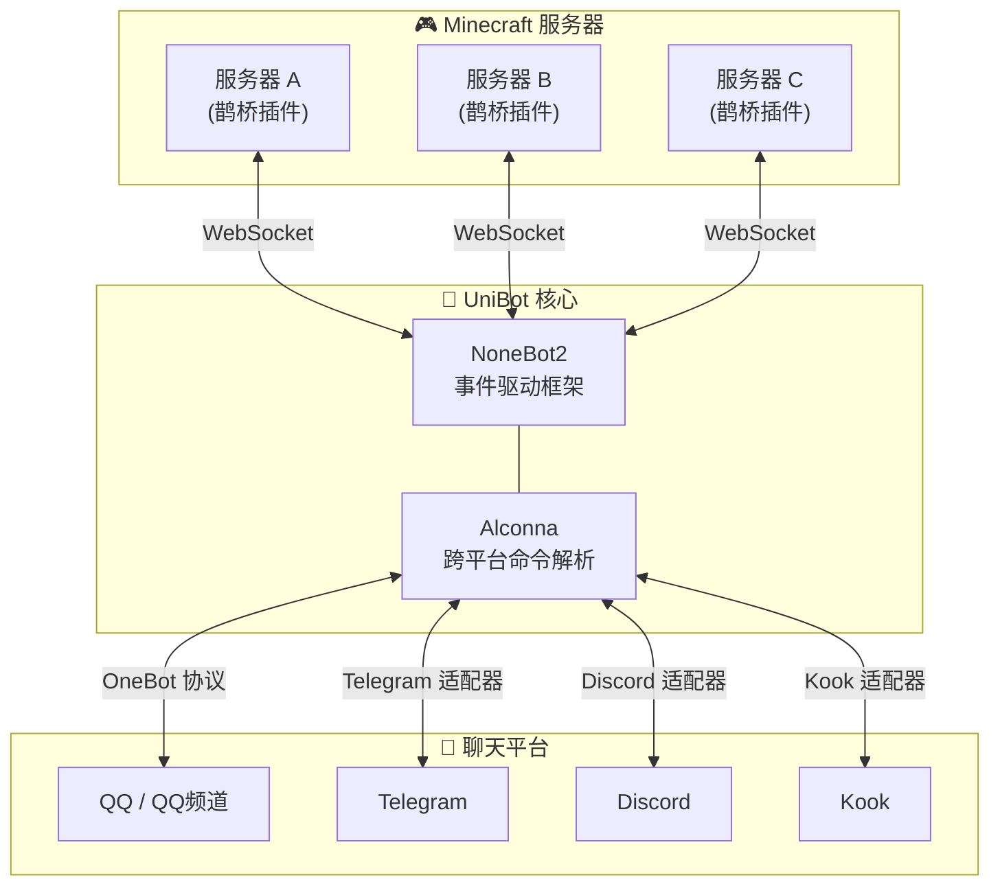

# 架构设计

UniBot 采用 **NoneBot2 事件驱动** 架构，插件与脚本分离，职责清晰。

## 整体架构

```txt
UniBot
├── nonebot2 核心                    ← 异步事件驱动框架
├── nonebot-adapter-minecraft       ← Minecraft WebSocket 通信
├── nonebot-plugin-alconna          ← 跨平台命令解析
├── nonebot-plugin-uninfo           ← 统一会话信息
├── Plugins/
│   ├── Commands/                   ← 独立指令模块
│   │   ├── About.py                ← 关于信息
│   │   ├── Bound.py                ← 白名单绑定
│   │   ├── Command.py              ← 远程指令执行
│   │   ├── Help.py                 ← 帮助系统
│   │   ├── List.py                 ← 在线玩家查询
│   │   ├── Luck.py                 ← 每日运势
│   │   ├── Send.py                 ← 消息发送
│   │   └── Server.py               ← 服务器状态
│   ├── Events.py                   ← MC 事件处理中枢
│   └── Expand/
│       ├── Ai.py                   ← AI 智能对话
│       └── Keywords.py             ← 关键词自动回复
├── Scripts/
│   ├── Managers/
│   │   ├── Data.py                 ← 数据持久化
│   │   ├── Server.py               ← 服务器连接管理
│   │   ├── WebUi.py                ← Web UI 静态资源管理
│   │   ├── Plugin.py               ← 插件管理
│   │   └── Version.py              ← 版本管理
│   ├── Api/                        ← REST API 路由
│   │   ├── Auth.py                 ← 登录认证（JWT / Cookie）
│   │   ├── Config.py               ← 配置管理
│   │   ├── Players.py              ← 玩家管理
│   │   ├── Servers.py              ← 服务器管理
│   │   ├── Plugins.py              ← 插件管理
│   │   ├── Logs.py                 ← 日志查看
│   │   ├── Status.py               ← 状态监控
│   │   ├── Users.py                ← 用户管理
│   │   ├── WebSocket.py            ← WebSocket 推送
│   │   └── Schemas.py              ← 数据模型与校验
│   ├── Config.py                   ← 配置模型定义
│   ├── Network.py                  ← 网络请求工具
│   ├── Utils.py                    ← 工具函数
│   └── Render.py                   ← 图片渲染引擎
└── WebUi/                          ← Vue 3 管理面板前端
    ├── src/
    │   ├── views/                  ← 各功能页面
    │   ├── stores/                 ← Pinia 状态管理
    │   ├── router/                 ← 路由配置
    │   ├── utils/                  ← 工具函数
    │   └── composables/            ← 组合式 API
    └── assets/                     ← 静态资源
```

## 通信流程



## 核心机制

### 事件驱动

机器人基于 NoneBot2 的事件驱动模型。`Plugins/Events.py` 作为事件处理中枢，接收来自 MC 适配器的服务器事件（玩家加入/离开、聊天、死亡等），并分发到对应的同步逻辑。

### 管理器单例

所有管理器采用 **单例模式**，在文件底部实例化，通过 `Scripts/Managers/__init__.py` 统一导出：

- `data_manager`：数据持久化（玩家、服务器、用户数据）
- `server_manager`：服务器连接管理
- `plugin_manager`：插件管理
- `version_manager`：版本管理
- `webui_manager`：WebUI 资源管理
- `config_manager`：配置管理

### 双入口启动

- **`Bot.py`**：初始化 NoneBot、注册适配器、加载插件、挂载 WebUI，然后运行。
- **`Watchdog.py`**：守护进程，启动 `Bot.py` 子进程，监控异常退出并自动重启，同时处理 WebUI 重启请求与依赖同步。

### 图片渲染

`Scripts/Render.py` 基于 Jinja2 + html2pic，将指令输出渲染为图片。模板位于 `Resources/Images/`。

### 数据持久化

`Data/` 目录下以 JSON 格式存储玩家、服务器、用户数据，通过 `data_manager` 管理，UTF-8 编码。

## 安全设计

- JWT 认证：`access_token`（2h）与 `refresh_token`（7d）通过 HttpOnly Cookie 下发。
- `get_current_user` 优先读取 Cookie，fallback 到 `Authorization: Bearer` Header。
- WebSocket 认证通过 Cookie 自动携带。
- 前端 fetch 启用 `credentials: 'include'`。